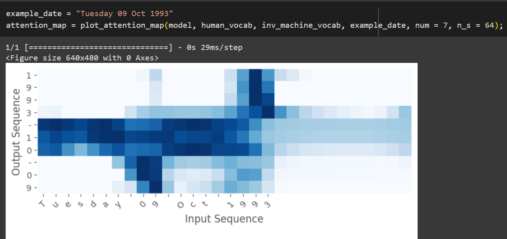

# Date Translation Project

## Overview

This project implements a Neural Machine Translation (NMT) model designed to translate human-readable date formats into machine-readable formats. The model leverages attention mechanisms to focus on relevant parts of the input date when generating the output. 

The main objective is to convert various date representations, such as "3 May 1979" or "21th of August 2016", into a standardized format (YYYY-MM-DD), making it easier for machines to interpret and process dates.

## Features

- Translates a variety of date formats into a consistent format.
- Utilizes an attention mechanism for better performance.
- Visualizes attention scores to show the model's focus during translation.

## Example Output

Here are some examples of the model's predictions:

1. **Input**: `3 May 1979`  
   **Output**: `1979-05-03`

2. **Input**: `5 April 09`  
   **Output**: `2009-04-05`

3. **Input**: `21th of August 2016`  
   **Output**: `2016-08-21`

## Attention Map Visualization

The attention map provides insight into how the model translates dates by showing the attention scores corresponding to each input character. Below is an example of an attention map generated during the translation process:

